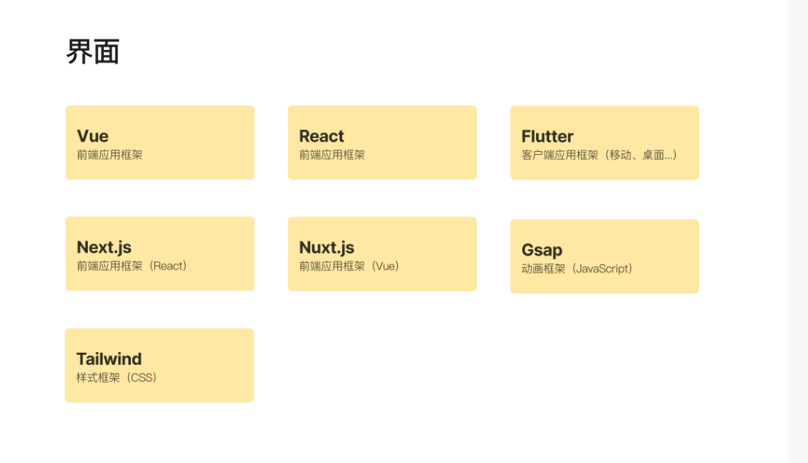

# 小白兔的开发之路
## Node.js 服务端应用开发实践

学历路径：
Node.js
TypeScript

Vue（前端应用框架）+ Nuxt.js(Vue前端应用框架) + Gsap(动画框架Javascript) + Tailwind（样式框架CSS）+ Strapi（服务端）

#### Nuxt.js 前端应用开发实践
https://ninghao.co/c/series/smTr0c

#### Strapi 服务端应用开发实战
https://ninghao.co/c/series/U2ve2f

#### Nuxt.js 前端应用开发实战
https://ninghao.co/c/series/ngFBAs

# Nuxt.js 学习计划

## 第一阶段：基础知识
- **目标**：掌握前端开发的基础。
- **内容**：
  - HTML/CSS：布局、响应式设计。
  - JavaScript：基础语法、函数、数组、对象。
  - Vue.js：组件、指令、生命周期、数据绑定。

## 第二阶段：Vue.js 深入学习
- **目标**：理解 Vue.js 的高级特性。
- **内容**：
  - 响应式数据和虚拟 DOM。
  - 计算属性、观察者。
  - Vue CLI 和 Vue Router。

## 第三阶段：Nuxt.js 入门
- **目标**：熟悉 Nuxt.js 的项目结构和配置。
- **内容**：
  - 创建 Nuxt.js 项目。
  - 学习 Nuxt.js 路由系统。
  - 理解服务器端渲染（SSR）和静态站点生成（SSG）。

## 第四阶段：Nuxt.js 核心特性
- **目标**：掌握 Nuxt.js 的核心功能。
- **内容**：
  - 服务器端渲染和静态站点生成。
  - Nuxt.js 模块化和插件系统。
  - 使用 Vuex 进行状态管理。

## 第五阶段：实战项目
- **目标**：通过实际项目巩固所学知识。
- **内容**：
  - 构建一个小型 Nuxt.js 应用。
  - 实现 API 路由和服务器端数据获取。
  - 用户认证、表单处理。

## 第六阶段：高级主题
- **目标**：学习 Nuxt.js 的高级优化和部署。
- **内容**：
  - 性能优化：代码分割、缓存策略。
  - Nuxt.js 模块生态系统。
  - 部署策略：服务器和静态托管服务。

## 第七阶段：社区和资源
- **目标**：融入 Nuxt.js 社区，获取最新信息。
- **内容**：
  - 加入 Nuxt.js 论坛、Slack 或 Discord。
  - 关注 Nuxt.js 博客、教程和视频。

## 第八阶段：持续学习
- **目标**：保持对 Nuxt.js 最新特性的了解。
- **内容**：
  - 参与开源项目。
  - 定期回顾和学习 Nuxt.js 更新。

## 学习资源
- [Nuxt.js 官方文档](https://nuxtjs.org/docs/get-started/installation)
- [Vue.js 官方文档](https://vuejs.org/v2/guide/)
- [Vue CLI 官方文档](https://cli.vuejs.org/)
- [Vue Router 官方文档](https://router.vuejs.org/)
- [Vuex 官方文档](https://vuex.vuejs.org/)

